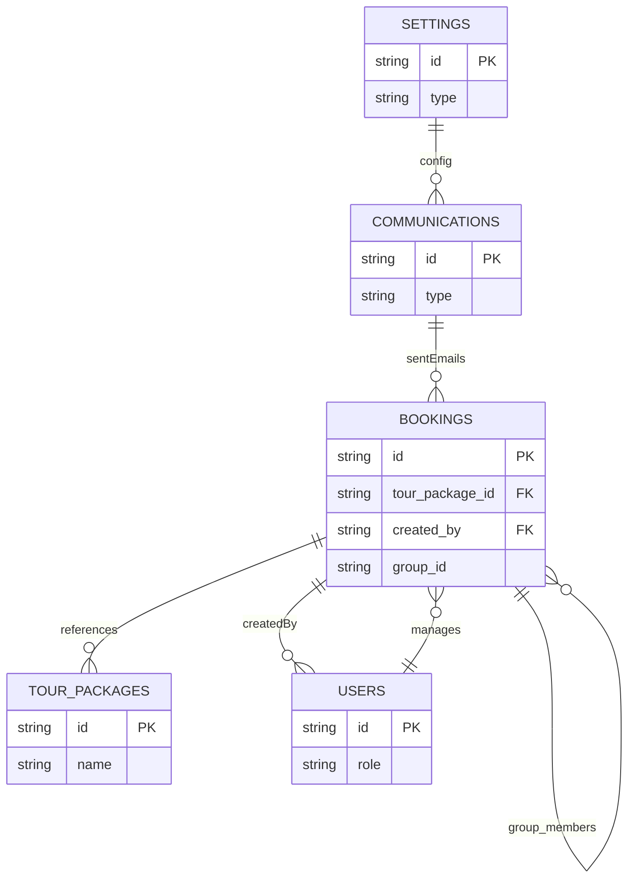

# Firestore Database Schema for ImHereTravels Admin Portal

## Core Collections

### 1. **Bookings** (`bookings`)
*Primary booking data storage*
```ts
{
  id: string; // Auto-generated Firestore ID
  bookingId: string; // TR-EC-20250712-JD-01 format
  traveler: {
    firstName: string;
    lastName: string;
    email: string;
    phone?: string;
  };
  tour: {
    packageId: string; // Reference to tourPackages
    name: string;
    date: Timestamp;
    returnDate: Timestamp;
    duration: number; // Days
  };
  reservation: {
    date: Timestamp;
    source: string; // Webform, Manual, Partner
    bookingType: "single" | "duo" | "group";
  };
  payment: {
    condition: "Invalid" | "Last Minute" | "Standard";
    terms: "Invalid" | "Full" | "P1" | "P2" | "P3" | "P4" | "Cancelled";
    plan: "Full" | "P1" | "P2" | "P3" | "P4";
    method?: "stripe" | "revolut" | "bank";
    originalCost: number;
    discountedCost?: number;
    reservationFee: number;
    paid: number;
    remainingBalance: number;
    enableReminders: boolean;
    cancellationReason?: "Tour Date too close" | "Fully booked" | "Tour Date Cancelled";
  };
  group: {
    id?: string; // DB-JD-5837-001 format
    isMainBooker: boolean;
    members: string[]; // References to other bookings
  };
  schedule: {
    full?: PaymentSchedule;
    P1?: PaymentSchedule;
    P2?: PaymentSchedule;
    P3?: PaymentSchedule;
    P4?: PaymentSchedule;
  };
  communications: {
    reservation: EmailStatus;
    cancellation?: EmailStatus;
    adventureKit?: EmailStatus;
    reminders: {
      P1?: ReminderStatus;
      P2?: ReminderStatus;
      P3?: ReminderStatus;
      P4?: ReminderStatus;
    }
  };
  metadata: {
    createdBy: string; // Reference to users
    createdAt: Timestamp;
    updatedAt: Timestamp;
    lastActivity: Timestamp;
  };
}

interface PaymentSchedule {
  amount: number;
  dueDate: Timestamp;
  scheduledReminder: Timestamp;
  calendarEventId?: string;
  paid: boolean;
  paidDate?: Timestamp;
}

interface EmailStatus {
  drafted: boolean;
  sent: boolean;
  sentDate?: Timestamp;
  subject: string;
  link?: string;
}

interface ReminderStatus {
  sent: boolean;
  sentDate: Timestamp;
  method: "email" | "calendar";
}
```

### 2. **Tour Packages** (`tourPackages`)
*Tour product catalog*
```ts
{
  id: string; // Auto-generated Firestore ID
  name: string;
  slug: string; // URL-friendly ID
  description: string;
  location: string;
  duration: number; // Days
  pricing: {
    original: number;
    discounted?: number;
    deposit: number;
    currency: "USD" | "EUR" | "GBP";
  };
  details: {
    highlights: string[];
    itinerary: {
      day: number;
      title: string;
      description: string;
    }[];
    requirements: string[];
  };
  media: {
    coverImage: string; // Storage path
    gallery: string[]; // Storage paths
  };
  status: "active" | "draft" | "archived";
  metadata: {
    createdAt: Timestamp;
    updatedAt: Timestamp;
    createdBy: string; // Reference to users
    bookingsCount: number;
  };
}
```

### 3. **Users** (`users`)
*Admin and agent accounts*
```ts
{
  id: string; // Matches Firebase Auth UID
  email: string;
  role: "admin" | "agent";
  profile: {
    firstName: string;
    lastName: string;
    avatar?: string; // Storage path
    timezone: string; // e.g., "Asia/Manila"
  };
  permissions: {
    canManageBookings: boolean;
    canManageTours: boolean;
    canManageTemplates: boolean;
    canManageUsers: boolean; // Admins only
    canAccessReports: boolean;
    canEditFinancials: boolean; // Admins only
  };
  preferences: {
    notifications: {
      newBookings: boolean;
      payments: boolean;
      cancellations: boolean;
    };
  };
  security: {
    lastLogin: Timestamp;
    lastPasswordReset: Timestamp;
    twoFactorEnabled: boolean;
  };
  metadata: {
    createdAt: Timestamp;
    updatedAt: Timestamp;
    isActive: boolean;
  };
}
```

### 4. **Communications** (`communications`)
*Email templates and history*
```ts
{
  id: string; // Auto-generated Firestore ID
  type: "reservation" | "payment-reminder" | "cancellation" | "adventure-kit";
  name: string;
  subject: string;
  content: string; // HTML content
  variables: string[]; // ["{{traveler_name}}", "{{tour_name}}"]
  status: "active" | "draft" | "archived";
  metadata: {
    createdAt: Timestamp;
    updatedAt: Timestamp;
    createdBy: string; // Reference to users
    usedCount: number;
  };
}

// Sent emails subcollection: communications/{templateId}/sentEmails
{
  id: string; // Auto-generated Firestore ID
  bookingId: string; // Reference to bookings
  recipient: string;
  subject: string;
  status: "sent" | "delivered" | "failed";
  opened: boolean;
  openedAt?: Timestamp;
  link: string; // Gmail message link
  metadata: {
    sentAt: Timestamp;
    sentBy: string; // Reference to users
  };
}
```

### 5. **Settings** (`settings`)
*System configuration*
```ts
{
  id: "paymentTerms";
  terms: {
    condition: string; // "Standard Booking, P1"
    term: string; // "P1"
  }[];
}

{
  id: "cancellationReasons";
  reasons: string[]; // ["Tour Date too close", ...]
}

{
  id: "emailConfig";
  provider: "resend" | "sendgrid" | "gmail";
  apiKey: string; // Encrypted
  fromAddress: string;
  bccAddresses: string[];
}

{
  id: "stripeConfig";
  apiKey: string; // Encrypted
  webhookSecret: string;
  dashboardLink: string;
}

{
  id: "calendarConfig";
  provider: "google";
  credentials: object; // Encrypted
}
```

## Subcollections

### 1. **Booking Activity** (`bookings/{bookingId}/activity`)
*Audit log for booking changes*
```ts
{
  id: string; // Auto-generated
  action: "created" | "updated" | "payment-received" | "email-sent" | "cancelled";
  field?: string; // For updates
  oldValue?: any;
  newValue?: any;
  performedBy: string; // Reference to users
  timestamp: Timestamp;
  notes?: string;
}
```

### 2. **Tour Statistics** (`tourPackages/{tourId}/stats`)
*Monthly performance data*
```ts
{
  id: string; // "2025-06"
  bookings: number;
  revenue: number;
  cancellations: number;
  avgBookingValue: number;
}
```

## Security Rules

```javascript
rules_version = '2';

service cloud.firestore {
  match /databases/{database}/documents {
    
    // User permissions
    function isAdmin() {
      return request.auth.token.role == "admin";
    }
    
    function isAgent() {
      return request.auth.token.role == "agent";
    }
    
    function userOwnsData() {
      return request.auth.uid == resource.data.userId;
    }
    
    // Bookings rules
    match /bookings/{bookingId} {
      allow read: if isAdmin() || isAgent();
      allow create: if isAdmin() || isAgent();
      allow update: if isAdmin() || 
                    (isAgent() && 
                     !request.resource.data.payment.hasOwnProperty('originalCost') &&
                     !request.resource.data.payment.hasOwnProperty('discountedCost'));
      allow delete: if false; // Soft delete only
    }
    
    // Tour packages rules
    match /tourPackages/{tourId} {
      allow read: if isAdmin() || isAgent();
      allow create, update, delete: if isAdmin();
    }
    
    // User management rules
    match /users/{userId} {
      allow read: if isAdmin() || request.auth.uid == userId;
      allow create: if isAdmin();
      allow update: if isAdmin() || request.auth.uid == userId;
      allow delete: if false; // Deactivate instead
    }
    
    // Settings rules
    match /settings/{settingId} {
      allow read: if isAdmin();
      allow write: if isAdmin();
    }
    
    // Communications templates
    match /communications/{templateId} {
      allow read: if isAdmin() || isAgent();
      allow write: if isAdmin();
    }
    
    // Sent emails
    match /communications/{templateId}/sentEmails/{emailId} {
      allow read: if isAdmin() || isAgent();
      allow create: if isAdmin() || isAgent();
    }
  }
}
```

## Indexes

### Bookings Collection
1. `tour.date` ASC + `payment.terms` ASC
2. `payment.remainingBalance` DESC
3. `traveler.email` ASC
4. `metadata.createdAt` DESC

### Tour Packages Collection
1. `status` ASC + `metadata.bookingsCount` DESC
2. `location` ASC + `name` ASC

### Users Collection
1. `role` ASC + `profile.lastName` ASC
2. `metadata.lastActivity` DESC

## Data Relationships



## Key Business Logic Implementation

### Payment Calculation (Cloud Function)
```ts
export const calculateBookingPayment = functions.firestore
  .document('bookings/{bookingId}')
  .onWrite(async (change, context) => {
    const newData = change.after.data();
    const oldData = change.before.data();
    
    if (!newData) return; // Document deleted
    
    // Recalculate if relevant fields change
    const recalcNeeded = (
      !oldData ||
      newData.tour.packageId !== oldData.tour.packageId ||
      newData.tour.date !== oldData.tour.date ||
      newData.reservation.date !== oldData.reservation.date ||
      newData.payment.terms !== oldData.payment.terms
    );
    
    if (!recalcNeeded) return;
    
    // Get tour package
    const tour = await getTourPackage(newData.tour.packageId);
    
    // Calculate costs
    const originalCost = tour.pricing.original;
    const discountedCost = newData.payment.useDiscount ? 
      tour.pricing.discounted || originalCost : 
      originalCost;
    
    const reservationFee = tour.pricing.deposit;
    const remainingBalance = discountedCost - reservationFee;
    
    // Calculate payment schedule
    const schedule = calculatePaymentSchedule(
      newData.payment.plan,
      newData.reservation.date,
      newData.tour.date,
      remainingBalance
    );
    
    // Update booking
    await change.after.ref.update({
      'payment.originalCost': originalCost,
      'payment.discountedCost': discountedCost,
      'payment.reservationFee': reservationFee,
      'payment.remainingBalance': remainingBalance,
      'schedule': schedule
    });
  });
```

### Due Date Calculation
```ts
function calculatePaymentSchedule(
  plan: PaymentPlan,
  reservationDate: Date,
  tourDate: Date,
  balance: number
) {
  const schedule: any = {};
  const months = {P1:1, P2:2, P3:3, P4:4}[plan] || 0;
  
  // Full payment special case
  if (plan === 'Full') {
    const dueDate = new Date(reservationDate);
    dueDate.setDate(dueDate.getDate() + 2);
    schedule.full = {
      amount: balance,
      dueDate: dueDate,
      scheduledReminder: new Date(dueDate.setDate(dueDate.getDate() - 3)),
      paid: false
    };
    return schedule;
  }
  
  // Generate payment dates (2nd of each month)
  for (let i = 1; i <= months; i++) {
    const dueDate = new Date(reservationDate);
    dueDate.setMonth(dueDate.getMonth() + i);
    dueDate.setDate(2);
    
    // Validate date constraints
    if (dueDate > new Date(reservationDate.getDate() + 2) && 
        dueDate < new Date(tourDate.getDate() - 3)) {
      schedule[`P${i}`] = {
        amount: balance / months,
        dueDate: dueDate,
        scheduledReminder: new Date(dueDate.setDate(dueDate.getDate() - 3)),
        paid: false
      };
    }
  }
  
  return schedule;
}
```

## Migration Script (Google Sheets → Firestore)

```ts
import { initializeApp } from "firebase-admin/app";
import { getFirestore } from "firebase-admin/firestore";
import { getSheetsData } from "./google-sheets-helper";

const migrateBookings = async () => {
  const sheetsData = await getSheetsData("Main Dashboard");
  
  const bookings = sheetsData.map((row) => {
    return {
      bookingId: row['Booking ID'],
      traveler: {
        firstName: row['First Name'],
        lastName: row['Last Name'],
        email: row['Email Address']
      },
      tour: {
        packageId: getTourIdByName(row['Tour Package Name']),
        date: new Date(row['Tour Date']),
        returnDate: new Date(row['Return Date']),
        duration: parseInt(row['Tour Duration'])
      },
      reservation: {
        date: new Date(row['Reservation Date']),
        bookingType: row['Booking Type']
      },
      payment: {
        condition: row['Payment Condition'],
        terms: row['Available Payment Terms'],
        plan: row['Payment Plan'],
        originalCost: row['Original Tour Cost'],
        discountedCost: row['Discounted Tour Cost'],
        reservationFee: row['Reservation Fee'],
        paid: row['Paid'],
        remainingBalance: row['Remaining Balance']
      },
      group: {
        id: row['Group ID'],
        isMainBooker: row['Is Main Booker?'] === "TRUE"
      },
      metadata: {
        createdAt: new Date(),
        updatedAt: new Date(),
        createdBy: "migration-script"
      }
    };
  });
  
  const db = getFirestore();
  const batch = db.batch();
  
  bookings.forEach(booking => {
    const ref = db.collection("bookings").doc();
    batch.set(ref, booking);
  });
  
  await batch.commit();
};

migrateBookings().then(() => console.log("Migration complete"));
```

This schema provides:
1. **Full parity** with existing Google Sheets functionality
2. **Scalable structure** for future enhancements
3. **Role-based security** with Firestore rules
4. **Business logic preservation** through Cloud Functions
5. **Audit trails** for compliance requirements
6. **Optimized indexes** for key queries

The design maintains all current workflows while enabling new capabilities like real-time collaboration, advanced reporting, and automated financial processing.