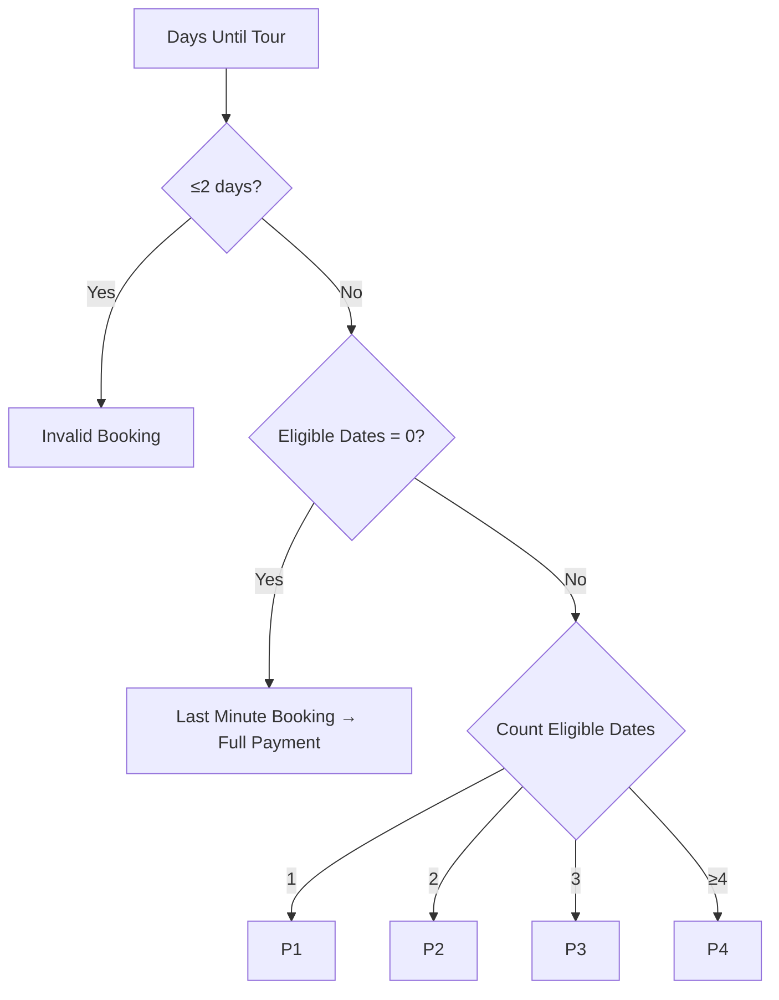

# ImHereTravels Booking System Documentation

## About: Migrating from Google Sheets
The ImHereTravels booking system was originally built on Google Sheets to manage tour bookings, payment plans, and customer communications. This documentation captures the complete system before migration to a web-based application. The Google Sheets solution features:
- Automated payment scheduling and reminders
- Dynamic email generation
- Group booking management
- Integrated calendar workflows
- Financial tracking and reconciliation

The migration aims to preserve all existing business logic while enhancing:
1. Real-time collaboration
2. Data security
3. Reporting capabilities
4. Mobile accessibility
5. Integration with payment gateways

## Existing Google Sheets Structure

### 1. Main Dashboard (Core Booking Management)

| Col | Name                         | Description                                                                 | Formula                                                                 |
|-----|------------------------------|-----------------------------------------------------------------------------|-------------------------------------------------------------------------|
| A   | Booking ID                   | Unique booking identifier                                                   | `=IF(N29="","",IF(COUNTA(L29:T29)<6, "", B29 & "-" & C29 & "-" & D29 & "-" & E29 & F29))` |
| G   | Email Address                | Traveler's contact email                                                   |                                                                         |
| H   | First Name                   | Traveler's first name                                                       |                                                                         |
| I   | Last Name                    | Traveler's last name                                                        |                                                                         |
| K   | Reservation Date             | Date booking was received                                                   |                                                                         |
| L   | Booking Type                 | Single/Duo/Group                                                            |                                                                         |
| M   | Tour Package Name            | Selected tour package                                                       |                                                                         |
| N   | Tour Date                    | Departure date                                                              |                                                                         |
| O   | Return Date                  | Calculated return date                                                      | `=IF(N27="","",IFERROR(N27 + VALUE(REGEXEXTRACT(P27, "(\d+)\s+Days")),""))` |
| P   | Tour Duration                | Duration in days (from Tour Packages)                                       | `=IFERROR(INDEX('{INDEX} Tour Packages'!$A:$ZZ,,MATCH(P$3,'{INDEX} Tour Packages'!$4:$4,0)),MATCH(M27,'{INDEX} Tour Packages'!$A:$A,0)),"")` |
| Q   | Payment Condition            | Determines payment eligibility                                              | `=IF(ISBLANK(N27),"",IFS(AND(R27=0,S27<=2),"Invalid Booking",AND(R27=0,S27>2),"Last Minute Booking",R27=1,"Standard Booking, P1",R27=2,"Standard Booking, P2",R27=3,"Standard Booking, P3",R27>=4,"Standard Booking, P4"))` |
| R   | Eligible 2nd of the Month    | Count of valid payment dates                                                | `=IF(OR(ISBLANK(K27),ISBLANK(N27)),"",LET(resDate,K27,tourDate,N27,monthCount,MAX(0,DATEDIF(resDate,tourDate-3,"M")+1),secondDates,ARRAYFORMULA(DATE(YEAR(resDate),MONTH(resDate)+SEQUENCE(monthCount),2)),validDates,FILTER(secondDates,(secondDates>resDate+2)*(secondDates<=tourDate-3)),IF(ISERROR(validDates),0,COUNTA(validDates))))` |
| S   | Days Between Booking and Tour| Days between reservation and departure                                     | `=IF(AND(K27<>"",N27<>""),N27-K27,"")`                                  |
| T   | Available Payment Terms      | Payment plan assignment                                                    | `=IF(ISBLANK(BV29),IFERROR(INDEX(INDEX('{INDEX} Payment Terms'!$A:$G,,MATCH(T$3,'{INDEX} Payment Terms'!$4:$4,0)),MATCH(Q29,INDEX('{INDEX} Payment Terms'!$A:$G,0,MATCH("Payment Condition",'{INDEX} Payment Terms'!$4:$4,0)),0)),""),"Cancelled")` |
| U   | Is Main Booker?              | Designates payment responsibility for groups                               |                                                                         |
| V   | Group ID Generator           | Creates unique group identifiers                                            | [Complex formula]                                                       |
| W   | Group ID                     | Shared ID for group bookings                                               |                                                                         |
| AF  | Original Tour Cost           | Base tour price                                                             | `=IF(M28="","",INDEX('{INDEX} Tour Packages'!$A:$ZP,MATCH($M28,'{INDEX} Tour Packages'!$A:$A,0),MATCH(AF$3,'{INDEX} Tour Packages'!$4:$4,0)))` |
| AG  | Discounted Tour Cost         | Promotional price (when applicable)                                        | `=IF(M36="","",INDEX('{INDEX} Tour Packages'!$A:$ZP,MATCH($M36,'{INDEX} Tour Packages'!$A:$A,0),MATCH(AG$3,'{INDEX} Tour Packages'!$4:$4,0)))` |
| AH  | Reservation Fee              | 15% deposit                                                                | `=IF(M28="","",INDEX('{INDEX} Tour Packages'!$A:$ZP,MATCH($M28,'{INDEX} Tour Packages'!$A:$A,0),MATCH(AH$3,'{INDEX} Tour Packages'!$4:$4,0)))` |
| AI  | Paid                         | Sum of received payments                                                   | `=IF(ISBLANK(M29),"",LET(paid,IF(AZ29<>"",AY29,0)+IF(BG29<>"",BF29,0)+IF(BN29<>"",BM29,0)+IF(BU29<>"",BT29,0),paid))` |
| AJ  | Remaining Balance            | Outstanding amount                                                         | `=IF(ISBLANK(M29),"",LET(base,IF(Y29=TRUE,AG29-AH29,AF29-AH29),paid,IF(AS29<>"",AR29,0)+IF(AZ29<>"",AY29,0)+IF(BG29<>"",BF29,0)+IF(BN29<>"",BM29,0)+IF(BU29<>"",BT29,0),rem,ROUND(base-paid,2),IF(rem<0,0,rem)))` |
| AQ  | Full Payment Due Date        | 48-hour deadline for full payments                                         | `=IF(AND(NOT(ISBLANK($K28)),$AK28="Full Payment"),TEXT($K28+2,"mmm d, yyyy"),"")` |
| AR  | Full Payment Amount          | Total due for full payment plans                                           | `=IF($AQ29<>"",IF($AK29="Full Payment",ROUND(IF($Y29,AG29,AF29)-AH29,2),""),"")` |
| AT  | P1 Scheduled Reminder Date   | 3-day advance reminder                                                     | `=IF(AND(ISDATE(AX28),ISBLANK(AZ28)),AX28-3,"")`                       |
| AX  | P1 Due Date                  | First instalment deadline                                                  | [Complex date calculation]                                              |
| AY  | P1 Amount                    | First instalment amount                                                    | `=IF($AX29<>"",SWITCH(TRUE,AK29="",ROUND(IF($Y29,AG29,AF29)-AH29,2)/1,AK29="P1",IF($Y29,AG29,AF29)-AH29,AK29="P2",ROUND((IF($Y29,AG29,AF29)-AH29)/2,2),AK29="P3",ROUND((IF($Y29,AG29,AF29)-AH29)/3,2),AK29="P4",ROUND((IF($Y29,AG29,AF29)-AH29)/4,2),""),"")` |
| BA  | P2 Scheduled Reminder Date   | Reminder for second payment                                                | `=IF(AND(ISDATE(BE28),ISBLANK(BG28)),BE28-3,"")`                       |
| BE  | P2 Due Date                  | Second instalment deadline                                                 | [Complex date calculation]                                              |
| BF  | P2 Amount                    | Second instalment amount                                                   | Similar to AY                                                           |
| BH  | P3 Scheduled Reminder Date   | Reminder for third payment                                                 | `=IF(AND(ISDATE(BL28),ISBLANK(BN28)),BL28-3,"")`                       |
| BL  | P3 Due Date                  | Third instalment deadline                                                  | [Complex date calculation]                                              |
| BM  | P3 Amount                    | Third instalment amount                                                    | Similar to AY                                                           |
| BO  | P4 Scheduled Reminder Date   | Reminder for fourth payment                                                | `=IF(AND(ISDATE(BS27),ISBLANK(BU27)),BS27-3,"")`                       |
| BS  | P4 Due Date                  | Fourth instalment deadline                                                 | [Complex date calculation]                                              |
| BT  | P4 Amount                    | Fourth instalment amount                                                   | Similar to AY                                                           |
| X   | Include BCC (Reservation)    | BCC option for reservation emails                                          |                                                                         |
| Y   | Use Discounted Tour Cost     | Toggle for promotional pricing                                             |                                                                         |
| Z   | Generate Email Draft         | Checkbox to create email draft                                             |                                                                         |
| AA  | Email Draft Link             | Gmail compose link                                                         |                                                                         |
| AB  | Subject Line (Reservation)   | Auto-generated email subject                                               |                                                                         |
| AC  | Send Email?                  | Confirmation of email sending                                              |                                                                         |
| AD  | Sent Email Link              | Link to sent message                                                       |                                                                         |
| AE  | Reservation Email Sent Date  | Timestamp of email delivery                                                |                                                                         |

### 2. Adventure Kit Dashboard
- Manages personalized tour document generation
- Contains traveler-specific flight details
- Triggers PDF generation and email delivery
- Key columns: Generate Email with Adventure Kit Draft, Email Draft Link, Send Email?

### 3. {INDEX} Sheets (Reference Data)

#### {INDEX} Tour Packages
| Column             | Description                                     | Example Value                      |
|--------------------|-------------------------------------------------|------------------------------------|
| Tour Name          | Package title                                   | Siargao Island Adventure           |
| Link               | Web URL                                         | [imheretravels.com/tour/siargao]   |
| Location           | Destination                                     | Siargao Island                     |
| Code               | Short code                                      | SIA                                |
| Duration           | Tour length in days                             | 6 Days                             |
| Status             | Current status                                  | Active                             |
| Description        | Detailed tour description                       | Experience the Siargao adventure...|
| Highlights         | Key features                                    | - Learn to wakeboard               |
| Itinerary          | Daily schedule                                  | Day 1: Arrival Bliss               |
| Price (USD)        | Base price                                      | 430                                |
| Deposit (USD)      | Reservation fee                                 | 150                                |

#### {INDEX} Payment Terms
| Payment Condition         | Available Payment Terms        |
|---------------------------|--------------------------------|
| Invalid Booking           | Invalid                        |
| Last Minute Booking       | Full payment required within 48hrs |
| Standard Booking, P1      | P1                             |
| Standard Booking, P2      | P2                             |
| Standard Booking, P3      | P3                             |
| Standard Booking, P4      | P4                             |

#### {INDEX} BCC Users
- Stores email addresses for BCC copies
- Simple list format (column A)

## Key Business Logic

### Payment Term Assignment

### Due Date Calculation
1. Generates all 2nd-of-month dates between:
   - Reservation Date + 2 days
   - Tour Date - 3 days
2. Selects dates based on payment plan:
   - P1: 1st valid date
   - P2: 2nd valid date
   - P3: 3rd valid date
   - P4: 4th valid date

### Group ID Generation
Format: `[DB/GB]-[Initials]-[EmailHash]-[MemberNumber]`
Example: `DB-JD-5837-001`
- DB = Duo Booking, GB = Group Booking
- JD = Traveler initials
- 5837 = Email hash
- 001 = Member sequence

## Migration Considerations

### Preserved Logic
- Payment term eligibility rules
- 2nd-of-month payment scheduling
- Group booking hierarchies
- Automated reminder timing (3-day advance)
- Financial calculations and rounding

### Enhanced Features
- Real-time payment tracking with Stripe
- Collaborative booking management
- Version-controlled email templates
- Role-based access control
- Mobile-responsive design
- Advanced reporting dashboard

### Data Migration Plan
1. **Phase 1**: Tour packages and payment terms
2. **Phase 2**: Active bookings
3. **Phase 3**: Historical booking data
4. **Phase 4**: Communication templates

This documentation provides a complete blueprint of the existing Google Sheets system, ensuring all business rules and workflows will be preserved and enhanced in the new web application.